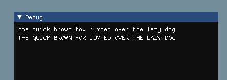

# GOLANG IMGUI PORTING EFFORTS
License will be MIT

A pure Go port of imgui as of github.com/ocornut/imgui commit  5ee40c8d34bea3009cf462ec963225bd22067e5e  
*(the remaining IMGUI code that needs to be ported from this commit are included in the repository)*  

It is important to me to have an Imgui package in pure Go, without any C code.
Ideally I would like the entire functionality of Imgui ported, including all
current widgets and features.

The end goal is to have the complete IMGUI demo window running 
natively in Go (so far demo window is only partially implemented).

## Current Status
The example directory contains a backend for glfw/opengl3 and a buildable
program.

`go get && go mod download && go build` with Go 1.16+ should build it just fine.

Besides the demo window, the port is technically complete but I am sure to have made mistakes during the port which have introduced bugs here and there.

## How to debug bugs

1. Clone imgui and checkout the commit hash specified at the top of this Readme,
2. Create an identical program in Go and C++
3. Either use a debugger and/or insert print lines and figure out how, why and when values are diverging.

## API Differences

I'm trying to stick as close to the C++ API as possible at the moment, at some stage, I think it would be nice to clean up the API to make it more idiomatic for Go

## Helpful tips for porting C++ to Go
I have stumbled upon a number of
roadblocks, and I have included a list of things to keep in mind when porting from C++ to Go.

1. Go has a stronger type system then C++, therefore any integer conversions need to be explicit

        var x uint16
        var y int32
        y = int32(x) //annoying but required for porting

2. A lot of the code I have seen, passes arrays by pointer, in Go
this can generally be replaced by a slice.

        STBTT_DEF int stbtt_GetNumberOfFonts(const unsigned char *data);
        //becomes
        func GetNumberOfFonts(data []byte) int {

3. Sometimes these C++ array pointers are incremented, I find this to be a very    
strange pattern but it can be replicated in Go by using a slice operation.
Keep in mind that the solution below only works for pointer increments, pointer decrements require a different approach (passing an additional index offset).

        //C++
        stbtt_uint8 *points;
        stbtt_uint8 flags = *points++; 

        //Go 
        var points []byte
        var flags byte = points[0] //get the first byte of the
        points = points[1:] //slice operation, moves the pointer forward by one byte
         slice
        

4. Go doesn't have struct/array constants, but you can just use a variable to 
hold the value.

        //C++
        const ImVec2 zero = ImVec2(0,0);
        //Go
        var zero = ImVec2{0,0}

5. Go doesn't have `static`, so the porting of the imgui debug window is
painful, perhaps it can be broken up into seperate functions? I don't know.

6. If a C++ function uses a *void pointer, this can be replaced with a Go
interface{} type, any value can be assigned to it.

        //C++
        void *userdata;
        //Go
        var userdata interface{}

7. Imgui appears to support callbacks of some kind, they are normally
passed as a struct, I am not too sure how this works in C++, but Go
has function types and closures that can be used instead.

        //C++
        typedef void    (*ImGuiSizeCallback)(ImGuiSizeCallbackData* data)
        //Go
        type ImGuiSizeCallback func(data *ImGuiSizeCallbackData)

8. Go doesn't have ternary operator.

        //C++
        int x = a ? b : c;
        //Go
        var x int32
        if a {
            x = b
        } else {
            x = c
        }

9. Go is garbage collected, so the ImGui/STB memory management can
be removed. Can just use builtin `new` and `make` for allocations.

10. I found it useful to move cpp files into the different packages and go through them function-by-function and delete them as I go to track porting progress. It's nice to see the lines of code in the file you are working on slowly go down as you
port them.
