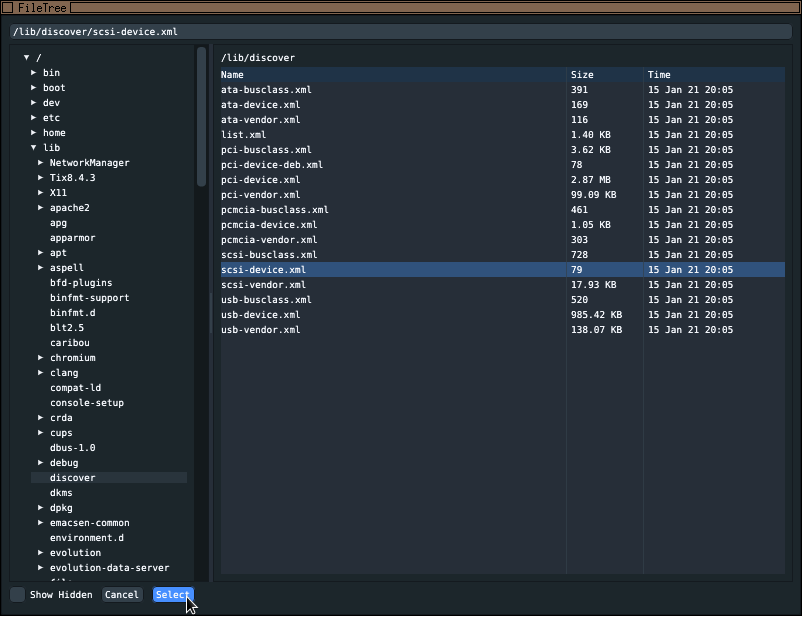

# FileTree browser
A little utility that displays a filesystem tree,
and then allows the user to select a file.

The path of the selected file will be written to stdout.

## Screenshots

## Why?
To learn the imgui library a bit.

And I needed a file selection dialog for imgui :X
